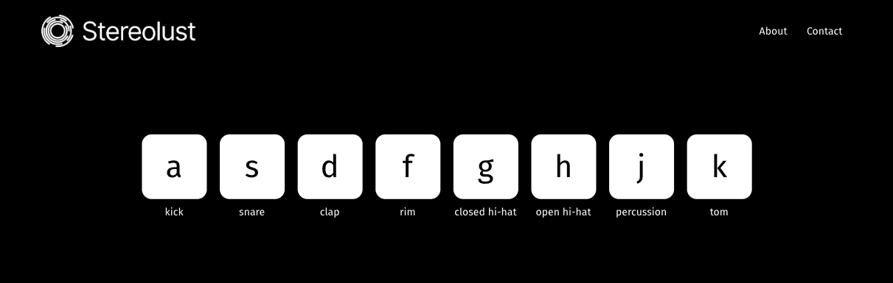

# Drum Machine

### Live link:

-   https://redimameti.github.io/drum-machine/

### Instructions

Simply press the correlating keyboard buttons for the drum sound you'd like to play, then, cook up a fire beat.

## The idea

As of deploying this app I'm 2/3rds of the way through a coding bootcamp to become a full stack developer.

I've also been an avid music producer/fanatic for about 6 years, so this project serves as a way to combine an existing passion and hobby with my current career pathway.

I decided to title the page Stereolust as a placeholder brand name (although, it's growing on me so I might keep it).

It will be for future audio-related programming projects I have in mind. I'd like to learn C++ and the JUCE framework to create audio plugins one day, so this is a tiny way I'm laying groundwork for then.

## Implementation

I couldn't find a tutorial for exactly what I had in mind, as I wanted to use React for future re-usability of components in case I decide to add different sound kits or make other changes (most tutorials I found were in Javascript).

I created the components first, then looked through a few Drum machine Javascript tutorials to fill in some knowledge gaps (this is my first time forraying into working with any audio inside an IDE).
